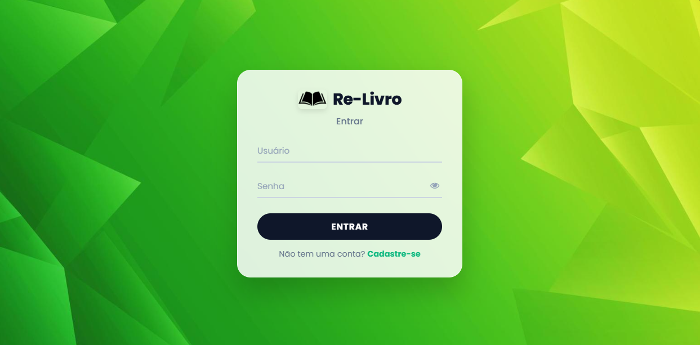
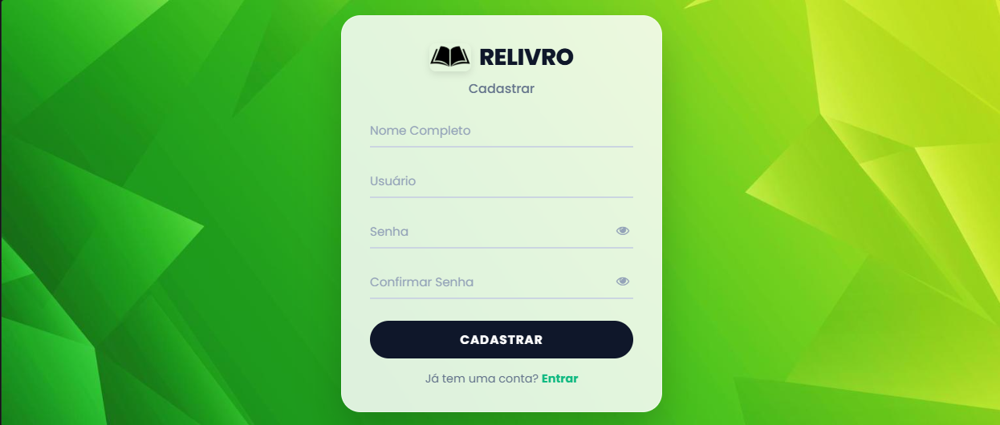
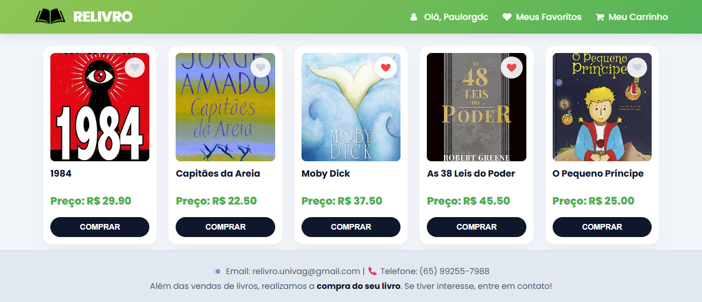
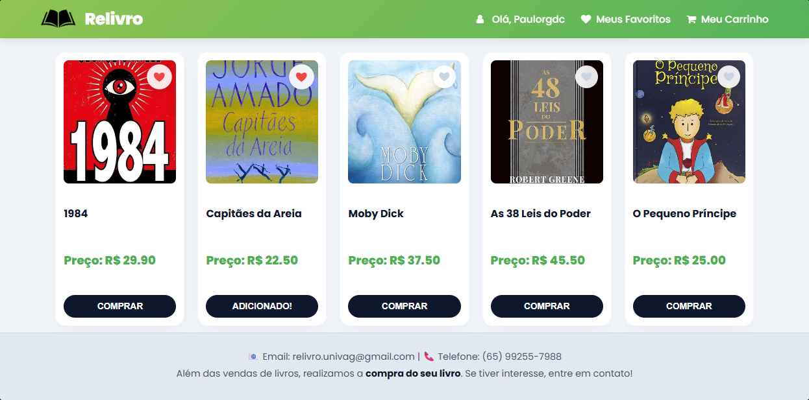
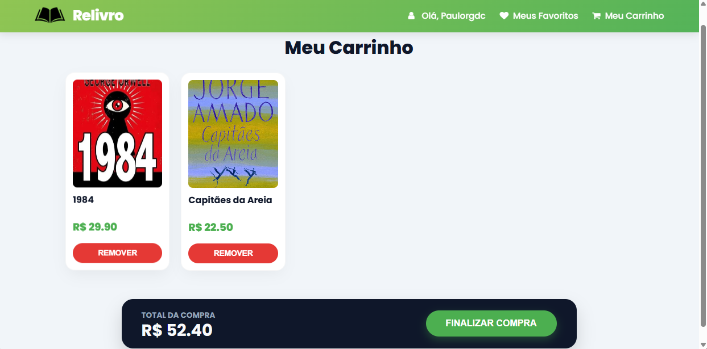
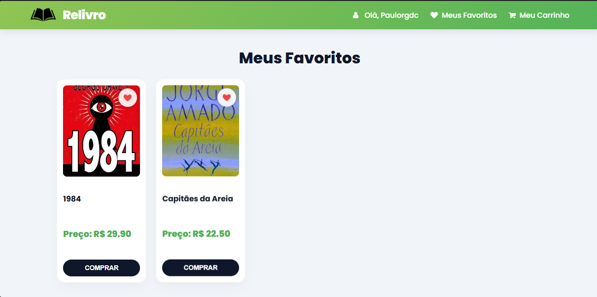
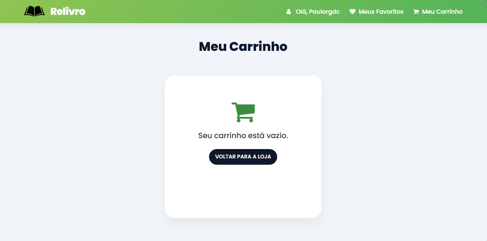
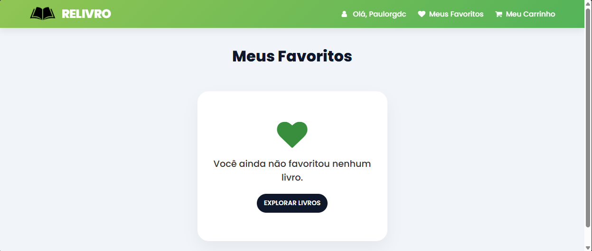

# 📚 RELIVRO | Modern Book Marketplace 📖


**Re-Livro** is a high-end online marketplace designed for book enthusiasts to discover, buy, and exchange literature. It features a seamless user experience focused on sustainability and cultural access, providing a specialized environment for building a circular economy among readers.

---

## 🚀 Features

- **Premium Marketplace UI:** A modern storefront with a focus on high-end typography and fluid responsiveness.
- **Smart Authentication:** Integrated login and registration system with real-time validation and persistent user sessions.
- **Interactive Wishlist:** Specialized dashboard for managing favorite titles using local data persistence.
- **Dynamic Shopping Cart:** Real-time cart management with automated price calculation and a streamlined checkout flow.
- **Session Management:** Secure access control ensuring personalized experiences and protected routes for authenticated users.
- **Sustainability Driven:** Core architecture designed to facilitate book exchanges, promoting the reuse of cultural assets.

---

## 📸 Screenshots

### Platform Entrance



### Shopping Experience
<p align="center">
  
  
</p>

### Cart & Favorites
<p align="center">
  
  
</p>

### Empty States
<p align="center">
  
  
</p>

---

## 🛠️ Installation & Setup

To run this project locally, follow these steps:

1. **Clone the repository:**
   ```bash
   git clone [https://github.com/Paulorgdc/RELIVRO.git](https://github.com/Paulorgdc/RELIVRO.git)
   cd RELIVRO
